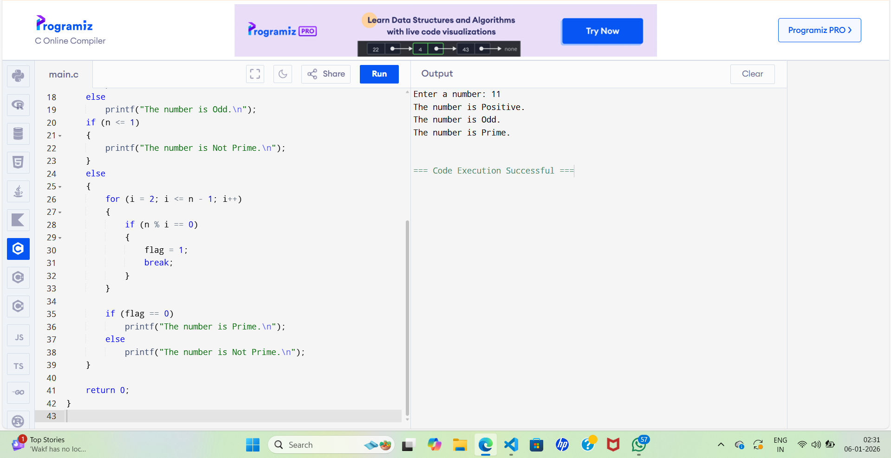

## 📖 Project Description  
The **Number Classification System** is a C programming project that analyzes a given integer and classifies it based on its basic mathematical properties.  
The program determines whether the number is **positive, negative, or zero**, checks whether it is **even or odd**, and identifies whether it is a **prime number**.

This project focuses on applying fundamental C programming concepts to solve a real-world numerical problem in a simple and efficient way.

---

## 🎯 Why This Project Was Created  
This project was created to:
- Strengthen understanding of **basic C programming concepts**
- Practice the use of **conditional statements and loops**
- Improve logical thinking and problem-solving ability
- Apply theoretical knowledge in a **practical implementation**
- Gain hands-on experience in developing a complete mini project

---

## 🛠️ Utility of the Project  
The Number Classification System is useful for:
- Academic learning and **C programming practicals**
- Beginners who want to understand **number classification logic**
- Basic mathematical validation tasks
- Serving as a **foundation project** for more advanced numerical systems

---

## ✨ Features  
- Accepts an integer input from the user  
- Classifies the number as **positive, negative, or zero**  
- Determines whether the number is **even or odd**  
- Checks whether the number is **prime or not**  
- Simple, clear, and user-friendly console output  

---

## 🧠 Algorithm Used  
1. Start the program.  
2. Ask the user to enter a number.  
3. Read the number using `scanf` and store it in a variable.  
4. Use conditional statements to check whether the number is positive, negative, or zero.  
5. Use the modulo operator (`%`) to check whether the number is even or odd.  
6. Start a loop from 2 to `n-1` to check for prime number.  
7. If the number is divisible by any value in the loop, mark it as not prime.  
8. If no divisor is found, the number is prime.  
9. Display all classification results.  
10. End the program.

---

## 🔮 Future Scope  
This project can be enhanced in the future by:
- Adding checks for **Armstrong**, **Palindrome**, and **Perfect numbers**
- Converting the program into a **menu-driven application**
- Allowing classification of **multiple numbers**
- Using **functions** for better modularity
- Adding **file handling** to store results
- Developing a **GUI-based version** of the project

---

## 🖥️ Output Screenshot  

The screenshot below shows the output after successful execution of the program:

> 📌 *Note:*  
>  Upload a screenshot of your program output in the repository and name it output.png**Output.png**  
> .

---

## 💻 Technology Used  
The following technologies and tools were used in the development of this project:

- **Programming Language:** C  
- **Compiler:** GCC / Dev C++ / Code::Blocks / Turbo C  
- **Core Concepts:**
  - Conditional Statements (`if-else`)
  - Looping Constructs (`for` loop)
  - Modulo Operator (`%`)
  - Standard Input/Output Functions (`scanf`, `printf`)
  - Basic Algorithm Design  

---

## ▶️ How to Run the Project  
Follow the steps below to run the project:

1. Install any standard **C compiler** (GCC, Dev C++, Code::Blocks, etc.).  
2. Clone or download this GitHub repository.  
3. Open the `.c` source file in the compiler.  
4. Compile the program to ensure there are no errors.  
5. Run the program after successful compilation.  
6. Enter an integer number when prompted.  
7. View the classification results on the console.

---

## 🎓 Learning Outcomes  
After completing this project, the following learning outcomes were achieved:

- Clear understanding of **basic C programming syntax**
- Practical use of **conditional statements and loops**
- Ability to implement **logical checks for numbers**
- Improved **problem-solving and analytical skills**
- Experience in creating a **well-documented GitHub project**
- Confidence in developing **basic console-based applications**

---

